# ForcePlatformCore

Ushbu dastur kuch platformasi bilan bog'lanish va ma'lumotlarni saqlash uchun qo'llaniladi.

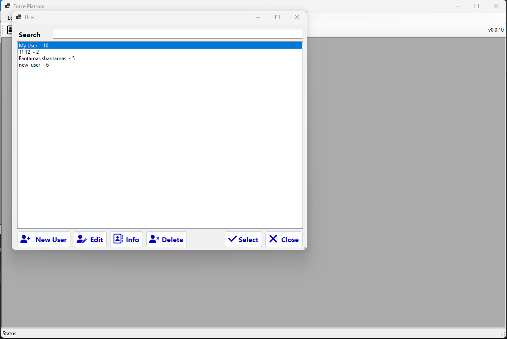

dasturni boshlashdan oldin tajribachini tanlash lozim, tajribachi tanlanmagan holatda dastur faqat platformadan kelayotgan signallarni ko'rish rejimida ishlaydi:

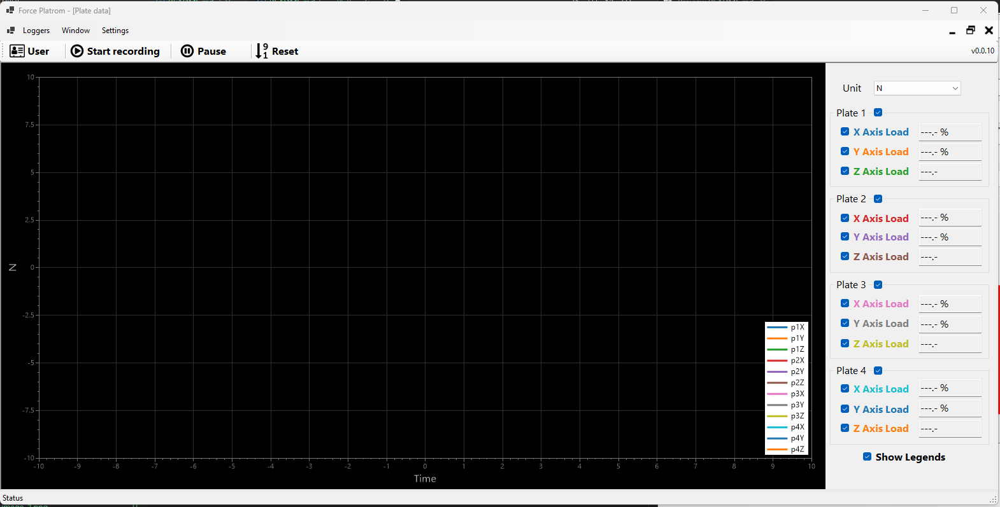

### Tajribachini qo'shish, yangilash va ma'lumotlarini olish

datur ishlashni boshlaganida quyidagi oyna paydo bo'ladi bundan siz tajribachini qo'shishingiz, antropometrik ma'lumotlarini o'zgartirishingiz va ua haqidagi ma'lumotlarni olishingiz mumkin:

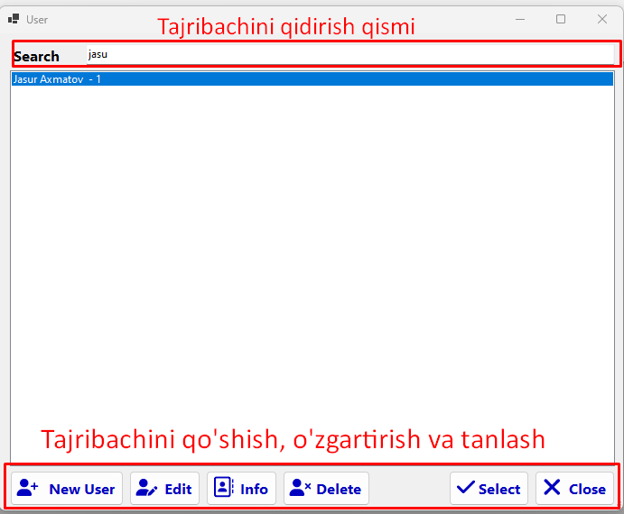

```New User``` tugmasini bosganingizda ```Add``` oynasi ochiladi, bu oyna orqali siz yangi tajribachini qo'shishingiz mumkin:

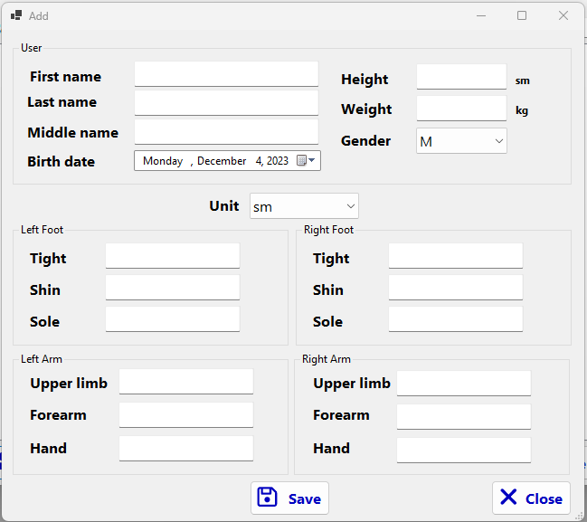

```Edit``` tugmasini bosganingizda ```Edit``` oynasi ochiladi va bu oyna orqali tajribachini ma'lumotlarini tahrirlashingiz mummkin:

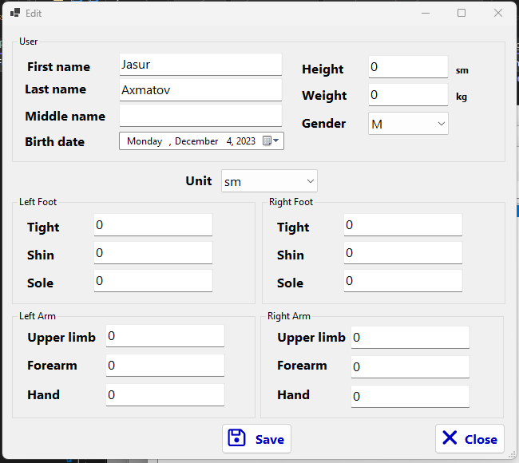

```Info``` tugmasini bosganingizda ```Info``` oynasi ochiladi va bu oyna da tajribachining antropometrik ma'lumotlari va undan olingan tajribalarni ko'rishingiz mumkin:

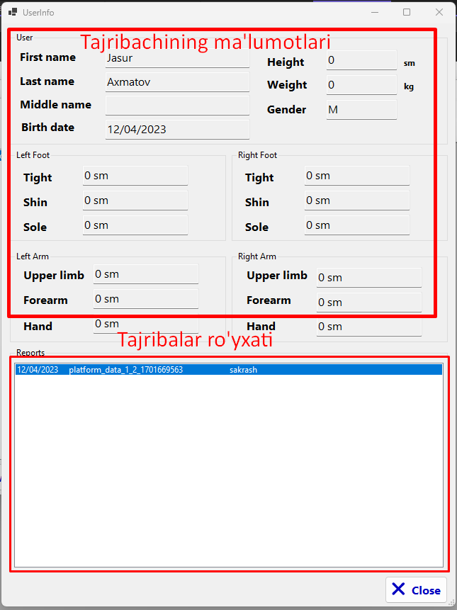

```Select``` tugmasi orqali siz tanlangan tajribachini dasturda aktiv holatga olib kelasiz va barcha saqlanadigan ma'lumotlar shu tajribachi uchun yozilib boradi.

### Tajriba turlari

keyingi qadam tajriba turini tanlash: 

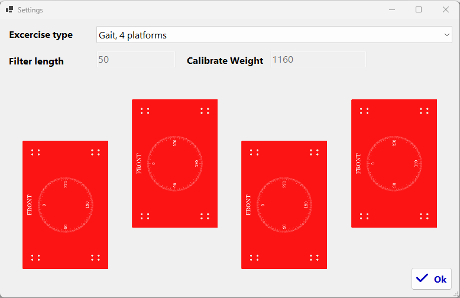

##### 1. Stability, 1st platform

Stabil turishda platformaning faqatgina bitta plati ishlatiladi va u statik holatda turgan mashqlar yoki bitta plate orqali bajariladigan mashqlarni kuzatish uchun foydalaniladi.

Bu holatda koordinata o'qlarining joylashishi quydagicha:

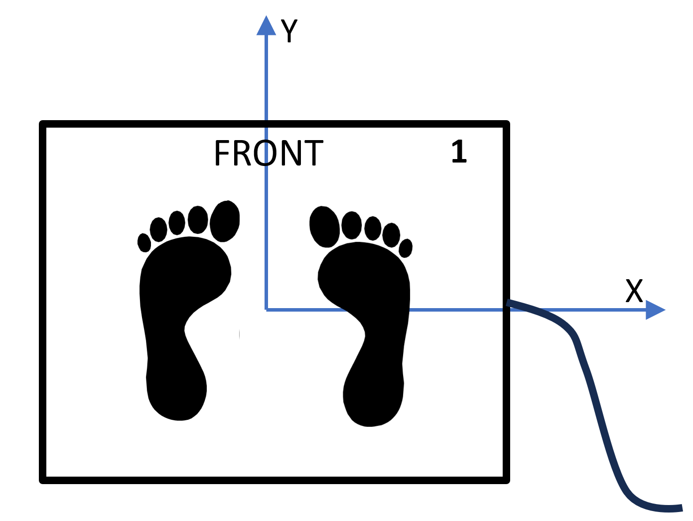

##### 2. Jump, 2 platforms

Sakrashda bitta platformadan yoki 2ta platformadan foydalanish mumkin, ikkita platformadan foydalangan paytda ularning joylashish tartibi quyidagicha bo'ladi:

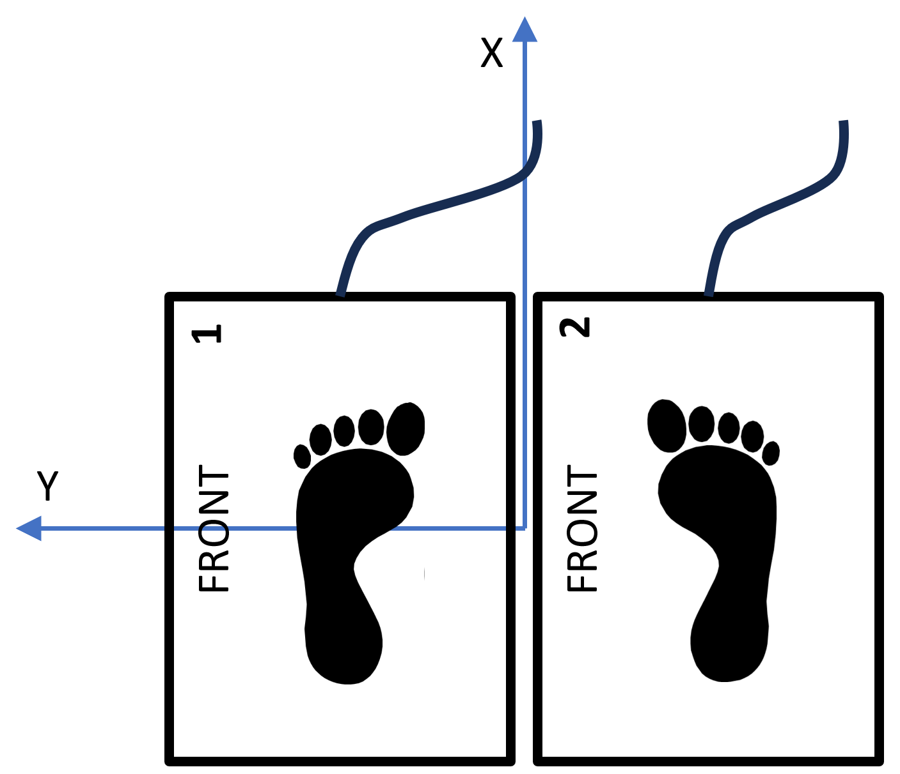

##### 3. Gait, 4 platforms

Yurish mashq turida platformalar quyidagicha joylashtiriladi:

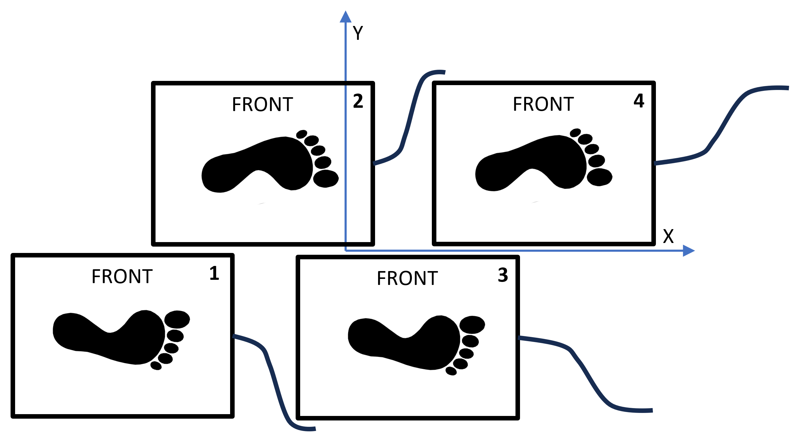

### Asosiy oyna

### Loggers->Plate Logger(menu)

Asosiy oynaga o'tilganida ```Plate Logger``` avtomatic tarzda ochiladi, agar ```Plate logger``` ochilmagan bo'lsa uni ```Loggers->Plate Logger``` menusi orqali ham ochish mumkin

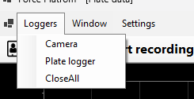


o'zingizga kerakli o'lchov birligini ```Nyuton```dan ```Kilogram```ga o'zgartirish uchun o'ng tomondagi ```Unit``` dropdownidan va kerakli signallarni qoldirish uchun esa uning pastidagi checkboxlardan foydalanishingiz mumkin.

### Loggers->Camera(menu)

```Logger``` menusida yan bir submenu ```Camera``` menusi, kompyuiterga ulangan web camerani aktivlashtirish uchun ishlatilad, agar ma'lumot bilan girga videoni ham yozib borishni istasangiz bu submenuni activlashtirishingiz kerak va ```Camera``` oynasi ma'lumot yozilayotgan paytda active bo'lishi lozim

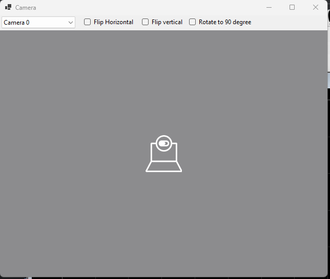

### Settings(menu)

Bu menu orqali dastur boshlanganda ochiladigan tajriba turini tanlash oynasini qayta ochib tajriba turinialmashtirishingiz mumkin

### Asosiy tugmalar

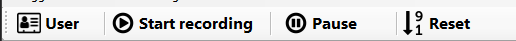

Agar dastur boshlanganida tajribachi tanlanmagan bo'lsa ```User``` tugmasi orqali tajribachilar ro'yxatini qayta ochib undan kerakli tajribachini almashtirishingiz yoki tanlashingiz mumkin:

```Start Recording``` agar tajribachi tanlanmagan bo'lsa olinayotgan ma'lumot doimiy xotiraga yozilmaydi:

```Pause``` - ma'lumotlarni olishni vaqtincha to'xtatib turish

```Reset``` - har bir tajribani boshalashdan oldin reset tugmasi bosiladi, bu tugma barcha parametrlarni 0ga tushiradi.
