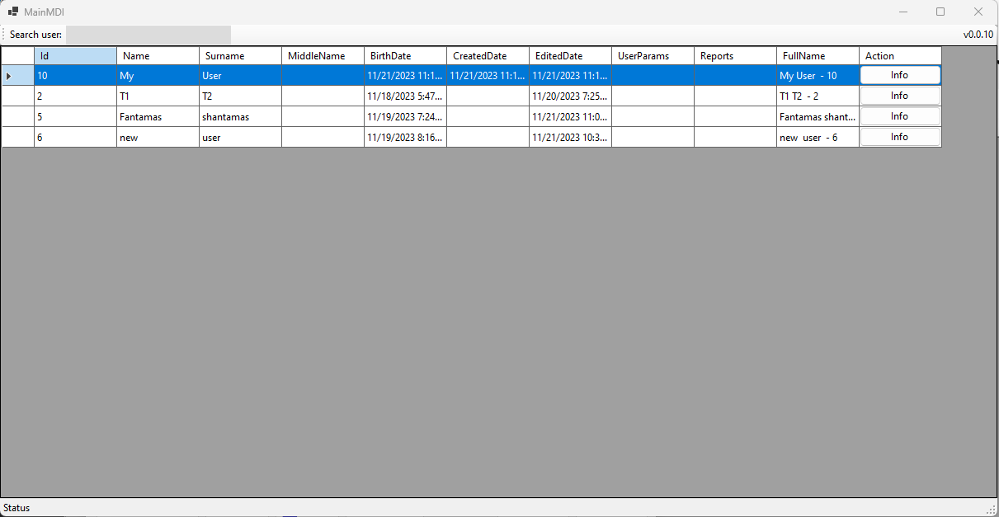
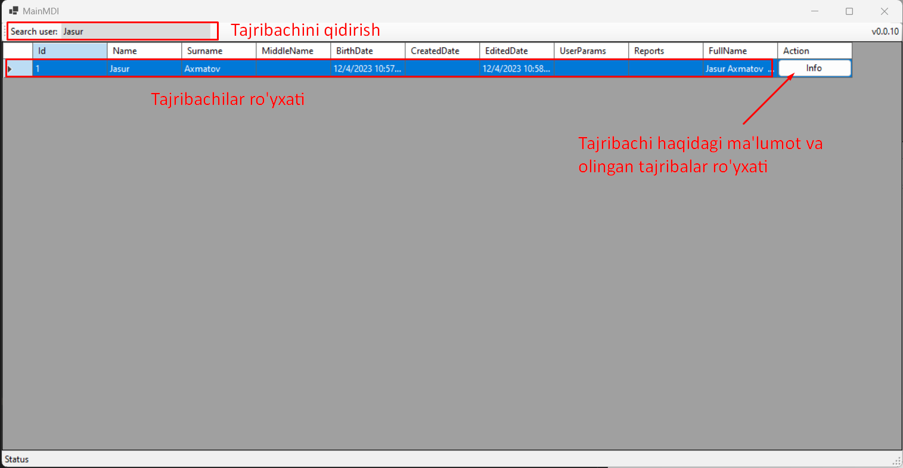
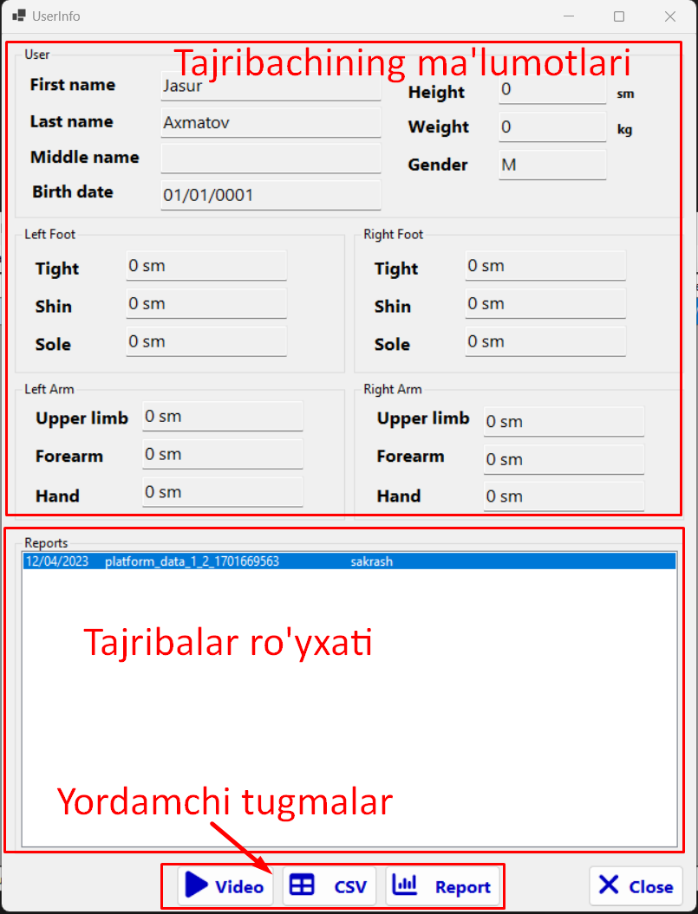
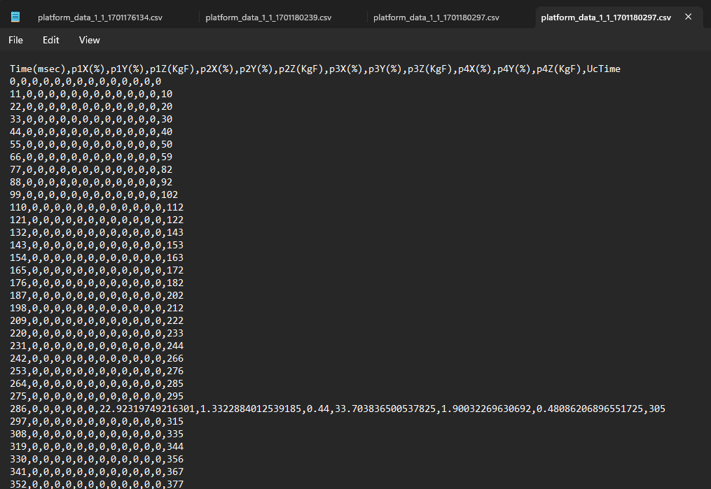
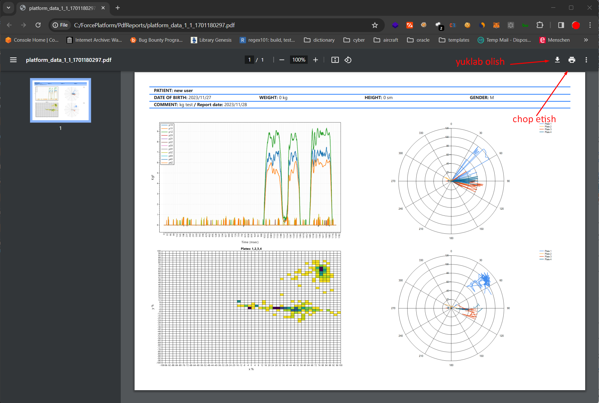
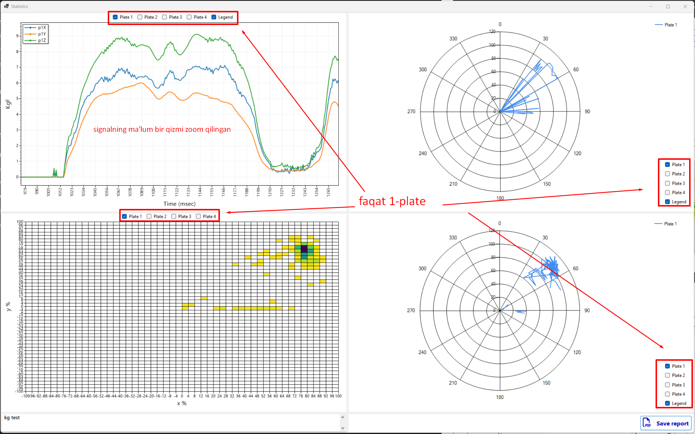
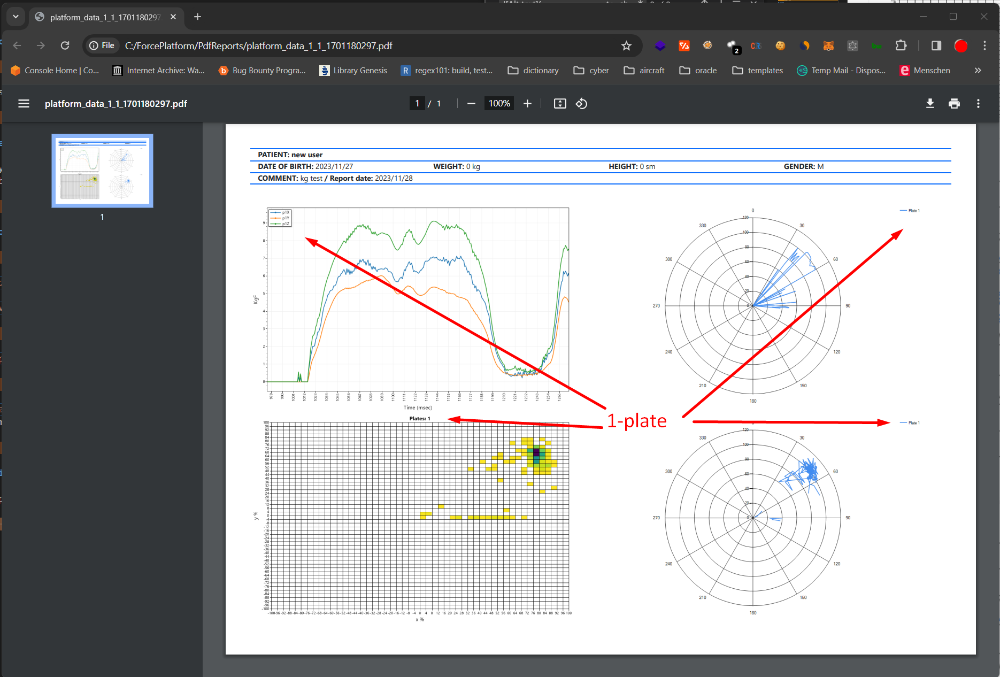

# ForcePlatformSmart



Bu dastur birlamchi tahlillarni tayyorlash va chop etish uchun qo'llaniladi



## UserInfo

Asosiy oynadan info tugmasini bosganish orqali quyidagi oyna ochiladi va u yerda tajribachi haqidagi ba'rcha antropometrik ma'lumotlar va olingan tajribalar ro'yxatini ko'rish mumkin: 



### Yordamchi tugmalar


```Video``` - tugmasi orqali agar tajriba davomida video yozib olingan bo'lsa yozib olingan videoni ko'rish mumkin.

```CSV``` - tugmasi orqali yozib olingan csv faylni tekst tahrirlovchisiga ochish.



```Report``` - tugmasi orqali ma'lumotlarga boshlang'ich ishlov berish mumkin.


```Statistics``` oynasidagi ```Save Report``` - tugmasi bosilganda, tanlangan ko'rinishni, ya'ni platformaning kerakli ajratib olingan platelaridagi ma'lumotlarni pdf formatidada saqlashva chop etish mumkin.



### Namuna uchun

Quyida platformaning birinchi platidagi ma'lumotning faqatgina bizga kerakli qismini chop etib kuraylik:



