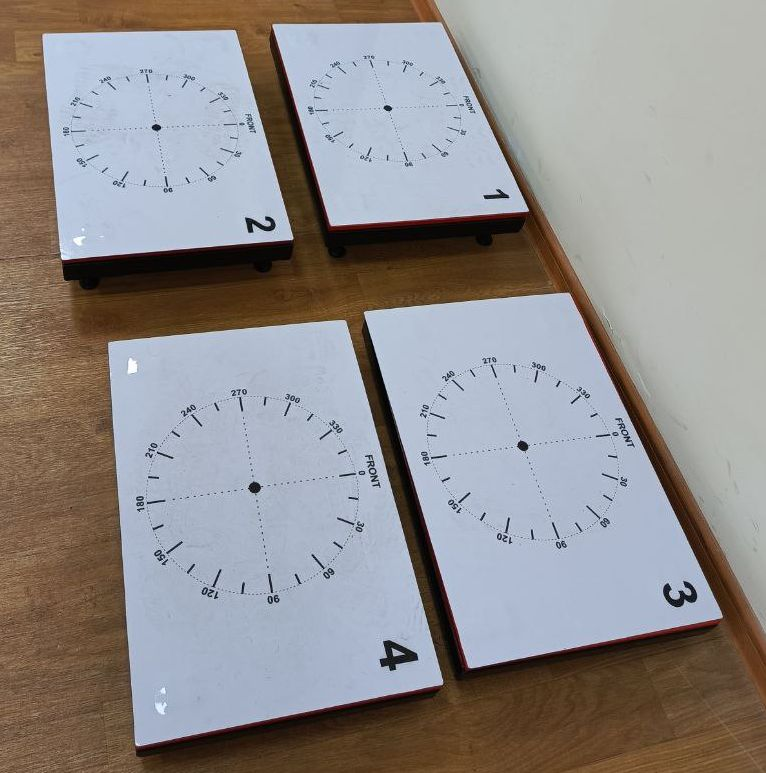

# Kuch platformasi


Kuch platformasining dasturiy taaminoti ikkita qismdan tashkil topgan
1. ForcePlatformCore - qurilma bilan bog'lanish va ma'lumotlarni saqlash uchun mo'ljallangan
2. ForcePlatformSmart - saqlangan ma'lumotlarga ishlov berish va tahlil qilish uchun mo'ljallangan

qurilma bitta boshqaruv blogi va to'rtta platformadan iborat:

#### Boshqaruv blogi


#### Platformalar



## Dasturlarni umumiy sozlanishi

Dasturyig'ilganidan so'ng uni ```C:\ForcePlatform``` katalogiga qo'yish kerak


```ForcePlatformCore``` dasturi birinchi marta yuruitilganda o'ziga kerakli bo'lgan kataloglarni sozlab oladi:


```Reports``` - o'zida ```csv``` formatidagi hisobotlarni saqlaydi, bu ma'lumotlar juda muxum bo'lib ularni xavfsizligini ta'minlash maqsadga muvofiq.

```PdfReports``` - bu katalog vaqtinchalik bo'lib uning ichidagi fayllarni o'chirishinbiz yoki vaqti vaqti bilan tozalab turishingiz mumkin.

```Videos```, ```vlc``` - videolarni ko'rish uchun ```vlc``` media playerri foydalanilgan.

```chrome``` - ```.pdf``` formatidagi hisobotlarni ko'rish va chop etish uchun ```chrome``` brawseridan foydalanilgan.

```platform.db``` - sportchilarning antropometrik ma'lumotlari va ulardan yig'ilgan hisobotlar sqlanadi

```appsettings.json``` - bu daturlarni umumiy sozlash uchun qo'llanilgan fayl

### appsettings.json

```json
{
  "AutoSelectCom": true, 
  "ComPort": "COM10", 
  "FilterLength": 50,
  "CalibrateZ": 1160,
  "FreeFallAcc": 8.91,
  "ReportsPath": "Reports",
  "VideosPath": "Videos",
  "ChromePath": "chrome\\App\\Chrome-bin\\chrome.exe",
  "VlcPath": "vlcplayer\\App\\vlc\\vlc.exe",
  "TemplatePath": "Templates",
  "PdfReportPath": "PdfReports"
}
```

```AutoSelectCom``` - portni avtomatik tarzda aniqlash boshida ```true``` yoki ```false``` qo'yish mumkin.```ComPort``` - agar port aniq bo'lsa uni o'zingiz kiritib qo'yishingiz mumkin. agar `AutoSelect` `true` bo'lsa buni dasturning o'zi kerakli portga o'zgartirib qo'yadi.

```FilterLength``` - qurilmaning sezuvchanligi boshida ```50``` qiymati urnatilgan buladi.

```CalibrateZ``` - sportchining og'irligini kalibrovka qilishda aniqlangan qiymat, hozircha ```11600``` ga teng.

```FreeFallAcc``` - erkin tushish tezlanishi

```ReportsPath``` - ```.csv``` formatida saqlanadigan fayllar katalogi.

```VideosPath``` - video namunalar saqlanadigan katalog.

```ChromePath``` - chrome brawser katalogi

```VlcPath``` - vlcplayer saqlanadigan katalog.

```TemplatePath``` - hisobot tayyorlashdagi namunalar saqlanadigan katalog

```PdfReportPath``` - ```.pdf``` hisobotlar saqlanadigan katalog.